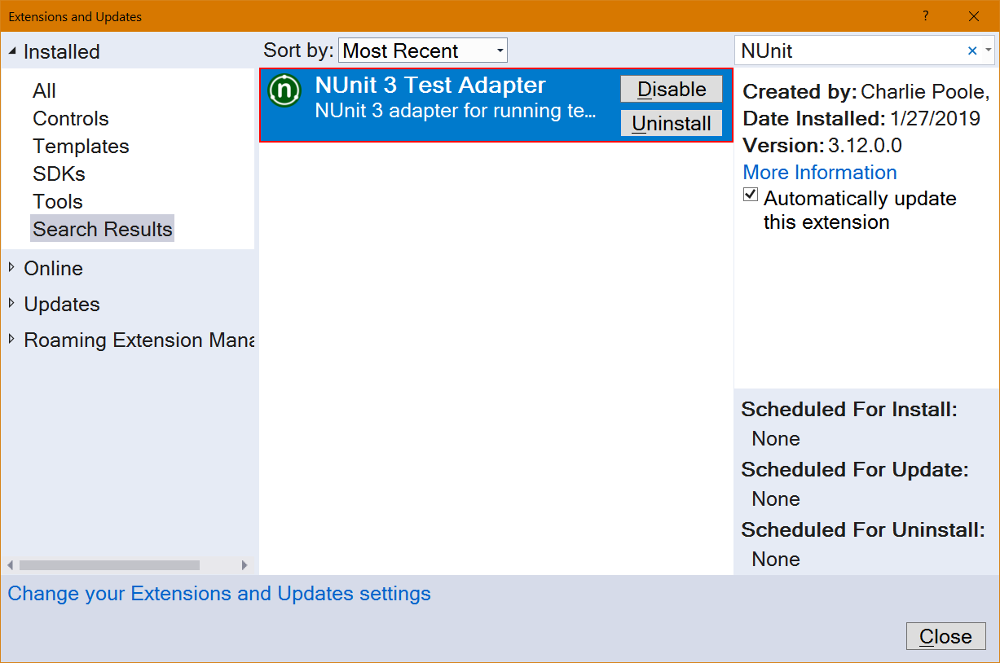
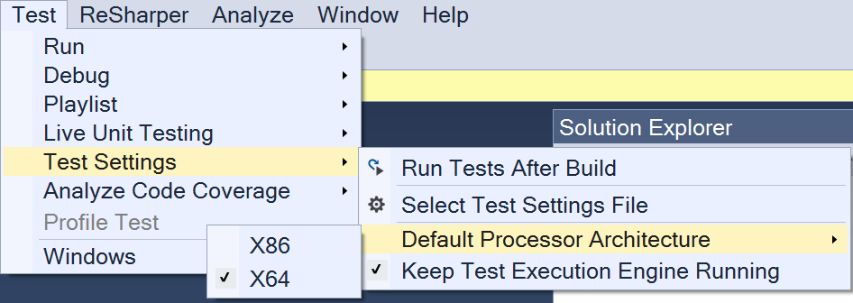
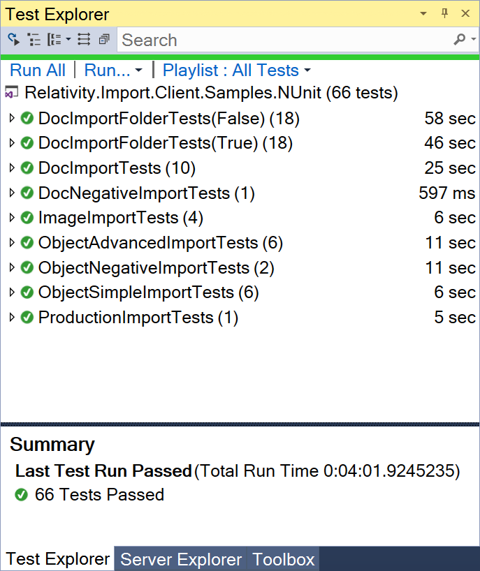

# Import API Samples

This repository demonstrates how the Import API can be used to import the following:

* Native documents
* Images
* Objects
* Productions

All of the samples are based on [NUnit](https://nunit.org/), they follow the [AAA](https://docs.microsoft.com/en-us/visualstudio/test/unit-test-basics?view=vs-2017#write-your-tests) test structure pattern, and app.config settings are used to define test parameters including Relativity URL's and login credentials. Once these settings have been made, the tests are 100% responsible for all required setup and tear down procedures. Finally, the Relativity.Import.Client.Samples.NUnit C# test project relies on [Relativity NuGet packages](https://www.nuget.org/packages?q=Relativity) to ensure Import API and all dependencies are deployed to the proper target directory.

## Prerequisites

* Visual Studio 2017
* NUnit Test Adapter
* A bluestem (9.7) or above test environment
* Visual C++ 2010 x86 Runtime
* Visual C++ 2015 x64 Runtime

**Note:** Relativity strongly recommends [using a developer Dev VM](https://platform.relativity.com/9.6/Content/Relativity_Platform/Testing_custom_applications.htm?Highlight=vm#_Developer_test_VMs) for a given release.

## Setup
The steps below should only be required when the repo is being cloned for the first time.

## Step 1 - Install NUnit 3 Test Adapter
If Visual Studio hasn't already been setup with NUnit 3 Test Adapter, go to `Tools->Extensions and Updates` and install the extension.



## Step 2 - Identify the Branch
With each new Relativity release, a new branch is created to not only test and verify the Import API package but to ensure all package references are updated properly. As of this writing, the following three releases are available for consideration:


## Step 3 - Clone the Repo
Use the command-line or Visual Studio to clone the repo and target a branch from the previous step.

```bash
git clone -b release-9.7-bluestem https://github.com/relativitydev/import-api-samples.git
```

## Step 4 - Open the Solution
Launch Visual Studio 2017 and open the Relativity.Import.Client.Samples.NUnit.sln solution file.

## Step 5 - Update App Settings
Double-click the app.config file and update the following underneath the `appSettings` element:

| Setting                  | Description                                                               | Example                                             |
|--------------------------|---------------------------------------------------------------------------|-----------------------------------------------------|
| RelativityUrl            | The Relativity instance URL.                                              | https://hostname.mycompany.corp                     |
| RelativityRestUrl        | The Relativity Rest API URL.                                              | https://hostname.mycompany.corp/relativity.rest/api |
| RelativityServicesUrl    | The Relativity Services API URL.                                          | https://hostname.mycompany.corp/relativity.services |
| RelativityWebApiUrl      | The Relativity Web API URL.                                               | https://hostname.mycompany.corp/relativitywebapi    |
| RelativityUserName       | The Relativity login user name.                                           | email@company.com                                   |
| RelativityPassword       | The Relativity login password.                                            | SomePassword!                                       |
| WorkspaceTemplate        | The workspace template used to create a test workspace for each test run. | Relativity Starter Template                         |
| SqlDropWorkspaceDatabase | Specify whether to drop the SQL database when the test completes.         | True|False                                          |
| SqlInstanceName          | The SQL instance where the workspace databases are stored.                | hostname.mycompany.corp\EDDSINSTANCE001             |
| SqlAdminUserName         | The SQL system administrator user name.                                   | sa                                                  |
| SqlAdminPassword         | The SQL system administrator password.                                    | SomePassword!                                       |

**Note:** The SQL parameters are optional and generally reserverd to cleanup DevVM's immediately.

## Step 6 - Test Settings
In order to run the NUnit tests from within Visual Studio, the test settings must target X64. Go to `Test->Test Settings->Default Processor Architecture` and verify this is set to X64.



## Step 7 - Execute Tests
At this point, the first time setup is complete and should now be able to run all of the tests. If the test explorer isn't visible, go to `Test->Windows->Test Explorer` and click the `Run All` hyper-link at the top. Regardless of which method is used to execute tests, the following actions occur:

* A new test workspace is created (normally 15-30 seconds) to ensure tests are isolated.
* The tests are executed
* The test workspace is deleted
* The Test Explorer displays the results

If everything is working properly, the Test Explorer should look something like this:

